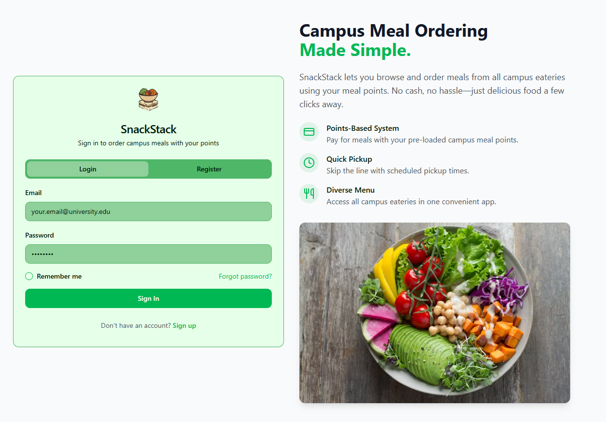
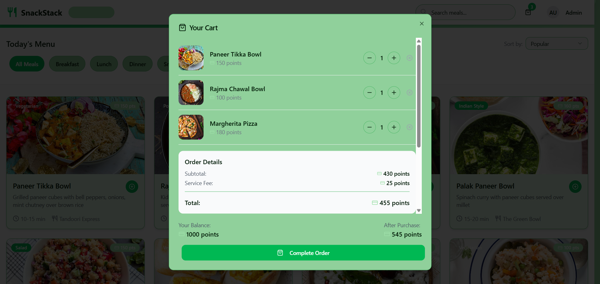

<p align="center">
  
</p>

# SnackStack - Campus Meal Ordering & Management System

[](https://www.gnu.org/licenses/agpl-3.0.en.html)
[](LICENSE-COMMERCIAL.txt)
[](https://github.com/NeuralAditya/SnackStack)
[](https://github.com/NeuralAditya/SnackStack/graphs/contributors)
[](https://github.com/NeuralAditya/SnackStack/issues)
[](https://github.com/NeuralAditya/SnackStack/commits/main)

SnackStack is a campus meal ordering system and management platform, built as a **Platform as a Service (PaaS)**. It aims to streamline the process of ordering food in college campuses by providing students and staff with a seamless experience from browsing menu items to managing their orders, all while enabling campus meal providers to efficiently manage their offerings and track sales.

## Features

- **Points System**: Operate on a points-based system; points can be easily purchased at your nearest canteen.

- **Student Ordering**: Browse available meals, add items to the cart, and place orders.
- **Meal Providers Dashboard**: Manage meals, pricing, and availability in real-time.
- **Order Management**: Track order status, cancel, and update orders.
- **Payment Integration**: Can be integrated with PalmPay/UPI, etc.
- **Admin Control**: Monitor system-wide usage, manage users, and analyze sales data.
- **Real-time Notifications**: Get updates on meal availability, order status, and more.

## Screenshots





## Tech Stack

- **Frontend**: React, Vite, Tailwind CSS
- **Backend**: Node.js, Express.js
- **Database**: PostgreSQL (with Drizzle ORM)
- **Authentication**: Passport.js (Local Strategy)
- **Payment Gateway**: Points Based System for now
- **Deployment**: Docker, Heroku / AWS / DigitalOcean (depending on preference)

## Setup & Installation

### Prerequisites

Ensure you have the following installed:

- [Node.js](https://nodejs.org/) (v16 or later)
- [npm](https://npmjs.com/) (comes with Node.js)
- [PostgreSQL](https://www.postgresql.org/) (or any supported database)
- [Docker](https://www.docker.com/) (for containerization, if preferred)

### Steps to Run the Project Locally

1. **Clone the repository:**
   ```bash
   git clone https://github.com/NeuralAditya/SnackStack.git
   cd SnackStack
   ```

2. **Install dependencies:**
   - For backend:
     ```bash
     cd server
     npm install
     ```
   - For frontend:
     ```bash
     cd client
     npm install
     ```

3. **Set up environment variables:**
   - Create `.env` files for both client and server, and add the required configurations like database credentials, JWT secret, etc.

4. **Start the backend server:**
   ```bash
   npm run dev
   ```

5. **Start the frontend server (in a separate terminal window):**
   ```bash
   npm run dev
   ```

6. **Navigate to `http://localhost:5000` to access the application.**

### Database Setup

Ensure you have PostgreSQL running locally or use a cloud service like [Heroku Postgres](https://www.heroku.com/postgres).

Run the migrations to set up the database schema:

```bash
npm run db:push
```

## Contributing

We welcome contributions! If you'd like to help out, please follow the steps below:

1. Fork the repository.
2. Create a new branch for your feature or fix:
   ```bash
   git checkout -b feature/my-new-feature
   ```
3. Make your changes.
4. Commit your changes:
   ```bash
   git commit -m "Add my new feature"
   ```
5. Push your branch:
   ```bash
   git push origin feature/my-new-feature
   ```
6. Open a pull request to the `main` branch.

Please ensure your code passes the tests and follows our coding standards before submitting a pull request.

## License

This project is **dual-licensed**:

- **GNU Affero General Public License v3.0 (AGPLv3)** – Open source under AGPLv3; see [LICENSE-AGPLv3.txt](LICENSE-AGPLv3.txt)
- **Commercial License** – For commercial use and proprietary licensing, see [LICENSE-COMMERCIAL.txt](LICENSE-COMMERCIAL.txt) or contact Brijesh.ml.ai@gmail.com


## Contributors

- **Aditya Arora** - [GitHub Profile](https://github.com/NeuralAditya)
- **Brijesh Gupta** - [Email For Commercial Use](mailto:brijesh.ml.ai@gmail.com)
- **Nikhil Gupta** - [Contributor](https://github.com/nikhilgupta)

---

Made with ❤️ by the SnackStack team.
